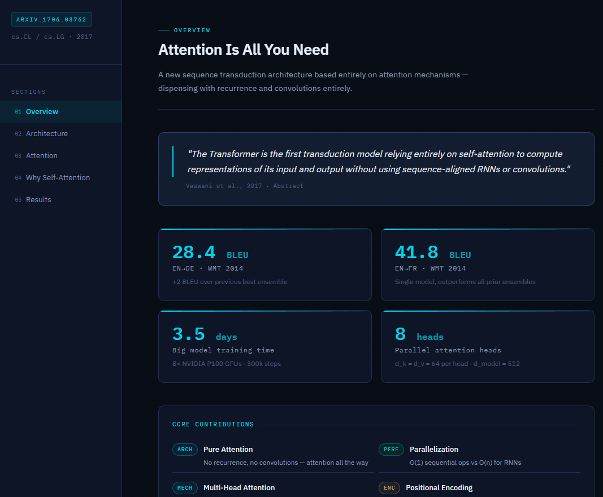
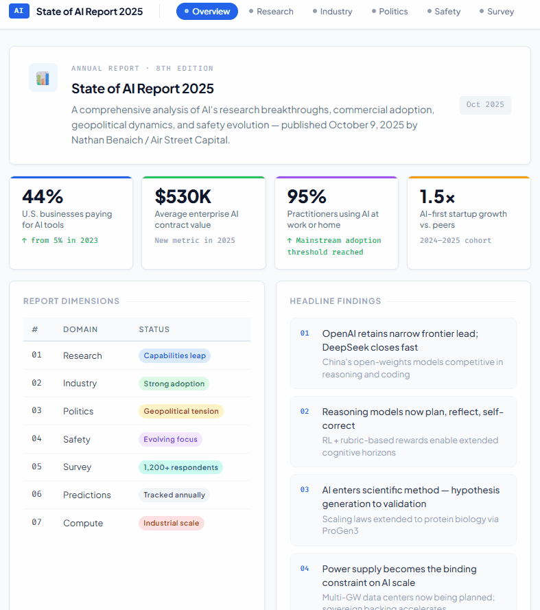
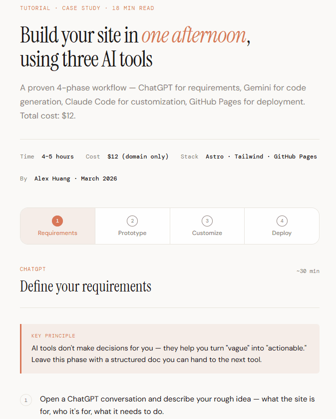

# zz-skills

[English](README.md) | [中文](README.zh.md)

Claude Code skills shared by [zerohzz](https://alex-huang.dev) — tools for building interactive content, recording demos, generating social images, and optimizing prompts.

## Installation

### Quick Install (Recommended)

```bash
npx skills add zerohzz/zz-skills
```

### Register as Plugin Marketplace

```bash
/plugin marketplace add zerohzz/zz-skills
```

### Install All Skills

```bash
/plugin install zz-skills@zz-skills
```

Or just tell Claude Code:

> Please install skills from github.com/zerohzz/zz-skills

## Update

1. Run `/plugin` in Claude Code
2. Switch to **Marketplaces** tab
3. Select **zz-skills** → **Update marketplace**

Enable **auto-update** to always get the latest versions.

## Skills

| Skill | Description |
|-------|-------------|
| [interactive-web](#interactive-web) | Transform articles into interactive web experiences |
| [gif-recorder](#gif-recorder) | Record any website as a polished animated GIF |
| [social-image](#social-image) | Transform content into multi-slide XHS/Instagram carousels |
| [write-prompt](#write-prompt) | Research-backed prompt optimizer with diagnostic analysis |

---

### interactive-web

Transform blog posts, essays, and technical articles into polished interactive web experiences. Runs a structured analysis pipeline, selects the right interaction model, commits to a matching aesthetic, and builds a production-quality single-file HTML artifact.

**Usage:**

```bash
/interactive-web posts/my-article.md
/interactive-web https://example.com/article
/interactive-web posts/my-article.md --model step-sequencer --design claude-like
```

**Trigger phrases:** `"Make this interactive"` · `"Turn my blog into a webpage"` · `"Visualize this article"` · `"Make this explorable"`

<details>
<summary>Pipeline</summary>

| Stage | Script | Input | Output |
|-------|--------|-------|--------|
| Normalize | `normalize_article.py` | Raw text / URL / file | `normalized.md` |
| Extract | `extract_structure.py` | `normalized.md` | `structure.json` |
| Blueprint | `build_page_plan.py` | `structure.json` | `blueprint.json` |
| Build | Claude (SKILL.md) | `blueprint.json` + article | Single-file HTML |

</details>

<details>
<summary>Interaction Models</summary>

| Pattern | Best For |
|---------|----------|
| `scroll-journey` | Narratives, opinion essays, long-form arguments |
| `step-sequencer` | Tutorials, how-tos, implementation walkthroughs |
| `concept-explorer` | Frameworks, layered ideas, capability models |
| `comparison-matrix` | Tool reviews, tradeoff analysis, side-by-side choices |
| `architecture-explainer` | Technical systems, flows, components, integrations |
| `decision-tree` | Strategic guides, diagnostic content, "which one" posts |
| `timeline` | Historical, chronological, before/after evolution |
| `data-dashboard` | Statistics-heavy, research-driven, metric-rich content |
| `filterable-gallery` | Pattern libraries, curated examples, reference roundups |
| `faq-explorer` | Q&A posts, FAQs, question-driven content |

</details>

<details>
<summary>Design Directions</summary>

| Direction | Character | Fonts |
|-----------|-----------|-------|
| `dark-technical` | Precision, monospace clarity, analytical depth | IBM Plex Sans + IBM Plex Mono |
| `editorial-ink` | Typographic authority, ink-on-paper weight | Playfair Display + Crimson Pro |
| `clean-analytical` | Tabular precision, high contrast, chart-friendly | Plus Jakarta Sans + Fira Code |
| `editorial-warm` | Forward momentum, approachable warmth | Newsreader + Nunito |
| `claude-like` | Quiet confidence, warm restraint, content-forward | Instrument Serif + DM Sans |

| Direction | Preview |
|-----------|---------|
| `dark-technical` |  |
| `editorial-ink` |  |
| `clean-analytical` |  |
| `editorial-warm` |  |
| `claude-like` |  |

</details>

<details>
<summary>Bundled Styles</summary>

Bundled styles lock in both a visual identity **and** an interaction model together.

| Style | Best For | Interaction | Fonts |
|-------|----------|-------------|-------|
| `story-scrollytelling` | Narrative essays, long-form arguments | scroll-journey | Cormorant Garamond + Lato |
| `bento-analytical` | Comparisons, tool reviews, data-rich breakdowns | comparison-matrix | Plus Jakarta Sans + Fira Code |
| `technical-glow` | Engineering, architecture, system design | architecture-explainer | IBM Plex Sans + IBM Plex Mono |
| `warm-cards` | Tutorials, how-tos, step-by-step walkthroughs | step-sequencer | Nunito + Fira Code |
| `glass-layered` | Concept frameworks, mental models | concept-explorer | Space Grotesk + Space Mono |

</details>

**Demo:** [alex-huang.dev/skill-lab/interactive-web](https://alex-huang.dev/skill-lab/interactive-web)

---

### gif-recorder

Record any website as a polished animated GIF — ready for README demos, social media, or presentations. Works entirely within Claude Code: fetches the page, reconstructs it as self-contained HTML, serves it on localhost, and records with Playwright.

**Usage:**

```bash
/gif-recorder https://example.com
```

**Trigger phrases:** `"Record my website as a GIF"` · `"Make a demo GIF"` · `"Create a screen recording of this URL"`

<details>
<summary>Options</summary>

**Cursor Modes:**

| Mode | Effect | Best For |
|------|--------|----------|
| `default` | Plain white arrow | Quick recordings, internal demos |
| `highlight` | Yellow glow + click ripple *(default)* | Tutorials, product walkthroughs |
| `minimal` | Faint white halo | Website demos, design products |
| `animated` | Blue multi-ring glow + motion trail | Marketing videos, landing pages |

**Output Control:**

```bash
--width 720 --height 1280        # Playwright viewport
--out-width 540 --out-height 960 # GIF output resolution
--max-size 5                     # Cap at 5 MB
```

</details>

---

### social-image

Transform blog posts and articles into multi-slide XHS (Little Red Book) / Instagram image carousels. Analyzes content weight, distributes across slides intelligently, rewrites copy in native XHS style, and renders each slide to PNG via Playwright.

**Usage:**

```bash
/social-image posts/my-article.md
/social-image https://example.com/article
/social-image posts/my-article.md --theme sketch --slides 9 --ratio 3:4
```

**Trigger phrases:** `"Turn this into XHS slides"` · `"Make a carousel"` · `"Create social media images"`

<details>
<summary>Options</summary>

| Parameter | Default | Options |
|-----------|---------|---------|
| `--slides` | 9 | 1–18 |
| `--ratio` | `3:4` | `3:4` (XHS), `9:16` (Stories), `1:1` (Feed) |
| `--theme` | auto | See below |
| `--lang` | auto-detect | `zh`, `en` |

**Themes:**

| Theme | Character |
|-------|-----------|
| `sketch` | Hand-drawn ink, loose and expressive |
| `editorial` | Clean layout, typographic authority |
| `terminal` | Dark monospace, code-terminal energy |
| `botanical` | Organic greens, nature-inspired softness |
| `clean-modern` | Minimal white space, contemporary clarity |
| `warm-paper` | Off-white paper tones, approachable warmth |
| `neo-brutalism` | Bold borders, high contrast, loud personality |
| `claude-like` | Quiet confidence, warm restraint |

</details>

---

### write-prompt

Research-backed prompt optimizer with diagnostic analysis. Classifies intent and complexity, selects the best structural pattern (Role-System, Task-Directive, Reasoning-Chain, Few-Shot, or Decomposed), and applies proven technique modules (Chain-of-Thought, examples, self-verification). Three modes: **optimize** (full diagnostic transformation), **refine** (surgical three-layer improvement), and **plan** (decompose goals into executable prompt chains).

**Usage:**

```bash
/write-prompt optimize "your raw prompt here"
/write-prompt refine "your existing structured prompt"
/write-prompt plan "your complex goal"
```

**Trigger phrases:** `"Optimize this prompt"` · `"Improve my prompt"` · `"优化提示词"` · `"Refine this prompt"`

---

## Prerequisites

- Claude Code installed and running
- Python 3.10+ (for `interactive-web` and `social-image` pipeline scripts)

## License

[MIT](LICENSE)

## Star History

[](https://www.star-history.com/#zerohzz/zz-skills&Date)
