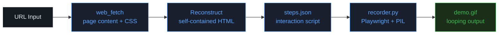

# gif-recorder

[](LICENSE)
[](#)

> **Record any website as a polished animated GIF — cursor effects, click ripples, scroll animation — in a single Claude conversation.**

---

## What It Does

`gif-recorder` is a Claude skill that turns a URL and a list of interaction steps into a production-ready animated GIF. Because Claude's sandbox can't drive an external browser directly, the skill uses a **fetch → reconstruct → serve locally → record** pipeline: it fetches the page, rebuilds it as a self-contained HTML file, spins up a localhost server, and records a Playwright session against it.

The output is a looping `.gif` ready for README demos, social media, or marketing pages — no screen recording software, no local setup, no post-processing.

---

## Quick Start

**1. Install the skill**

```bash
cp -r skill ~/.claude/skills/gif-recorder
```

**2. Trigger it in Claude Code**

Point Claude at a URL and describe what to record:

- `"Record my website as a GIF"`
- `"Make a demo GIF of my landing page — scroll down and click the CTA"`
- `"Create a screen recording of this URL for my README"`
- `"Capture this user flow as an animated GIF"`

**3. Get your GIF**

Claude will output a `.gif` to `/mnt/user-data/outputs/demo.gif`. Open it directly — no additional tooling required.

---

## Pipeline



| Stage | Tool | Input | Output |
|-------|------|-------|--------|
| Fetch | `web_fetch` | URL | Raw HTML + CSS |
| Reconstruct | Claude (SKILL.md) | Raw content | `gif_site/index.html` |
| Script | Claude (SKILL.md) | User flow description | `gif_steps.json` |
| Record | `recorder.py` | HTML + steps | `demo.gif` |

---

## Cursor Modes

Choose the cursor style to match the recording's intended use:

| Mode | Effect | Best For |
|------|--------|----------|
| `default` | Plain white arrow, no effects | Quick recordings, internal demos |
| `highlight` | Yellow glow halo + click ripple *(default)* | Tutorials, technical demos, product walkthroughs |
| `minimal` | Faint white halo, almost no effects | Website demos, design-oriented products |
| `animated` | Blue multi-ring glow + motion trail + click burst | Marketing videos, landing page showcases |

---

## Step Types

Interaction steps are defined in a `steps.json` file:

```json
[
  {"type": "wait",   "seconds": 2},
  {"type": "move",   "selector": "h1"},
  {"type": "scroll", "amount": 300},
  {"type": "click",  "selector": "button:has-text('Get Started')"},
  {"type": "snap",   "frames": 12}
]
```

| Type | Params | Description |
|------|--------|-------------|
| `wait` | `seconds` | Hold on current view (good for opening / ending frames) |
| `snap` | `frames` | Capture N frames without moving |
| `scroll` | `amount` (px) | Smooth downward scroll |
| `click` | `selector` | Animate cursor to element, click it |
| `move` | `selector` | Animate cursor to element without clicking |
| `scroll_to_bottom` | — | Scroll to page bottom |

---

## Output Sizes

| Ratio | Dimensions | Flag | Best For |
|-------|-----------|------|----------|
| 9:16 | 720 × 1280 | `--width 720 --height 1280` | Social media (default) |
| 16:9 | 1280 × 720 | `--width 1280 --height 720` | Wide presentations |
| 1:1 | 720 × 720 | `--width 720 --height 720` | Square posts |

---

## File Structure

```
gif-recorder/
├── skill/                      # The Claude skill itself
│   ├── SKILL.md                # Main skill definition (the prompt Claude reads)
│   └── scripts/
│       └── recorder.py         # Playwright recorder + cursor renderer + GIF exporter
├── README.md
└── LICENSE
```

---

## Dependencies

Required Python packages (pre-installed in Claude.ai sandbox):

```bash
pip install playwright pillow imageio --break-system-packages
playwright install chromium
```

---

## Known Limitations / Roadmap

1. **Reconstructed HTML fidelity** — pages that rely heavily on JavaScript-rendered content, authentication walls, or web fonts may look different from the live site. Improve by feeding more CSS paths to `web_fetch`.
2. **GIF file size** — complex pages at 12 fps can exceed 5 MB. Reduce with `--fps 8` or smaller dimensions.
3. **External asset dependencies** — the reconstructed HTML uses system fonts; brand typefaces loaded from external CDNs won't appear.
4. **Roadmap**: MP4/WebM export option, browser chrome mockup overlay, multi-page flow support, dark/light theme toggle in the reconstructed HTML.

---

## Contributing

1. Fork `zerohzz/zz-skills`
2. Create a branch: `git checkout -b feat/gif-recorder-your-change`
3. Make your changes in `gif-recorder/`
4. Submit a PR with a short description of what the change adds or fixes

Changes to `recorder.py` should be tested against at least 2 different sites and cursor modes before submission.

---

## License

MIT — see [LICENSE](LICENSE)

© 2026 zerohzz
