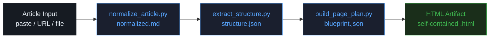

# interactive-web

[](LICENSE)
[](CHANGELOG.md)

> **Transform blog posts, essays, and technical articles into polished interactive web experiences — in a single Claude conversation.**

---

## What It Does

`interactive-web` is a Claude skill that acts as a content intelligence engine. You hand it any written article; it runs a structured analysis pipeline, selects the right interaction model for the content type, commits to a matching aesthetic direction, then generates a production-quality single-file HTML artifact.

It does **not** produce generic templates. Every output is designed for the specific article — the interaction model is chosen because it genuinely aids comprehension for that content's structure, and the aesthetic reflects the article's tone.

---

## Demo

**Live demo:** [alex-huang.dev/skill-lab/interactive-web](https://alex-huang.dev/skill-lab/interactive-web)

---

## Quick Start

**1. Install the skill**

```bash
# Place the skill/ directory in your Claude skills folder
cp -r skill ~/.claude/skills/interactive-web
```

**2. Trigger it in Claude Code**

Give Claude any article and say one of:
- `"Make this interactive"`
- `"Turn my blog post into a webpage"`
- `"Build an interactive explainer for this"`
- `"Visualize this article"`

**3. Get your artifact**

Claude will output a complete single-file HTML page. Open it directly in any browser — no build step, no server required.

---

## Pipeline



| Stage | Script | Input | Output |
|-------|--------|-------|--------|
| Normalize | `normalize_article.py` | Raw text / URL / file | `normalized.md` |
| Extract | `extract_structure.py` | `normalized.md` | `structure.json` |
| Blueprint | `build_page_plan.py` | `structure.json` | `blueprint.json` |
| Build | Claude (SKILL.md) | `blueprint.json` + article | Single-file HTML |

---

## Interaction Models

The skill selects one of 10 interaction patterns based on the article's content type and dominant structure:

| Pattern | Best For | Design Direction |
|---------|----------|-----------------|
| **Scroll Journey** | Narratives, opinion essays, long-form arguments | `editorial-ink` |
| **Step Sequencer** | Tutorials, how-tos, implementation walkthroughs | `editorial-warm` |
| **Concept Explorer** | Frameworks, layered ideas, capability models | `dark-technical` |
| **Comparison Matrix** | Tool reviews, tradeoff analysis, side-by-side choices | `clean-analytical` |
| **Architecture Explainer** | Technical systems, flows, components, integrations | `dark-technical` |
| **Decision Tree** | Strategic guides, diagnostic content, "which one" posts | `clean-analytical` |
| **Timeline Experience** | Historical, chronological, before/after evolution | `editorial-ink` |
| **Data Dashboard** | Statistics-heavy, research-driven, metric-rich content | `clean-analytical` |
| **Filterable Gallery** | Pattern libraries, curated examples, reference roundups | `editorial-warm` |
| **FAQ Explorer** | Q&A posts, FAQs, question-driven content | `editorial-warm` |

---

## Design Directions

| Direction | Character | Fonts | Palette |
|-----------|-----------|-------|---------|
| `dark-technical` | Precision, monospace clarity, analytical depth | IBM Plex Sans + IBM Plex Mono | Dark slate + electric blue/cyan |
| `editorial-ink` | Typographic authority, ink-on-paper weight, magazine density | Playfair Display + Crimson Pro | Aged paper + editorial red |
| `clean-analytical` | Tabular precision, high contrast, chart-friendly | Plus Jakarta Sans + Fira Code | Deep slate + cyan or amber |
| `editorial-warm` | Forward momentum, approachable warmth, milestone satisfaction | Newsreader + Nunito | Warm cream + burnt orange |

---

## File Structure

```
interactive-web/
├── skill/                          # The Claude skill itself
│   ├── SKILL.md                    # Main skill definition (the prompt Claude reads)
│   ├── references/
│   │   ├── design-principles.md    # 4 aesthetic directions + motion rules
│   │   ├── visualization-patterns.md  # Detailed per-model implementation guide
│   │   └── content-extraction-guide.md  # What to extract from each article type
│   ├── assets/
│   │   └── component-patterns.md   # Ready-to-use CSS/JS component snippets
│   └── scripts/
│       ├── normalize_article.py    # Stage 1: normalize input
│       ├── extract_structure.py    # Stage 2: extract structure → structure.json
│       └── build_page_plan.py      # Stage 3: select model + design → blueprint.json
├── README.md
├── CHANGELOG.md
└── LICENSE
```

---

## Known Limitations / Roadmap

1. **Script environment required** — the 3 Python scripts need Python 3.10+ to run; in environments without Python, Claude falls back to an in-context analysis brief (same logic, no intermediate JSON files).
2. **Single-file HTML only** — the current skill produces `.html` artifacts; `.jsx` output for React is documented but not tested with all 10 interaction models.
3. **No image handling** — articles with significant images (photo essays, visual tutorials) receive text-only treatments; image embedding is not yet supported.
4. **English-first** — the analysis pipeline is tuned for English content; other languages may produce lower-quality interaction model selection.
5. **Roadmap**: multi-article collection mode (generate a mini-site from 5+ articles), RSS feed → static site pipeline, Claude.ai Projects integration.

---

## Contributing

1. Fork `zerohzz/zz-skills`
2. Create a branch: `git checkout -b feat/interactive-web-your-change`
3. Make your changes in `interactive-web/`
4. Submit a PR with a short description of what the change adds or fixes

All contributions to the skill itself (SKILL.md, references/, scripts/) should be tested against at least 3 article types before submission.

---

## License

MIT — see [LICENSE](LICENSE)

© 2026 zerohzz
